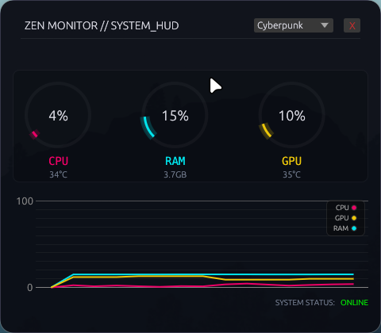
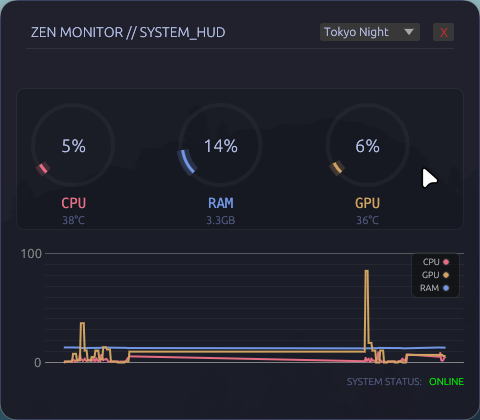
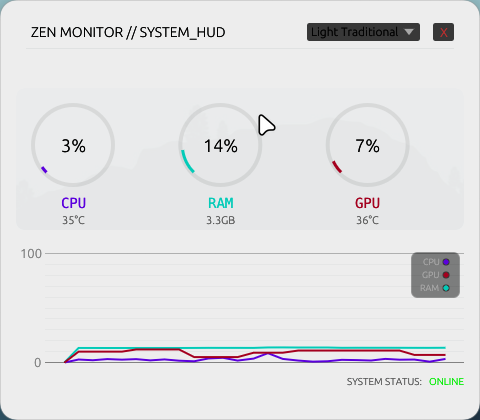

# Zen Monitor 🔮

**Zen Monitor** is a high-performance, aesthetically pleasing system monitoring tool designed for **Arch Linux (Hyprland)**, but compatible with all major Linux distributions and Windows 11. Built with **Rust** and `egui`, it features a "Cyberpunk/Glassmorphism" UI with real-time graphs and GPU support.



## Features
*   **Aesthetics:** Transparent, borderless window designed for tiling window managers (Hyprland, Sway) or modern Windows setups.
*   **Themes:** Built-in theme switcher with presets (Cyberpunk, Catppuccin, Tokyo Night, Dark, Light).
*   **Performance:** Lightweight (~15MB RAM), written in Rust.
*   **Metrics:** Real-time CPU usage/temps, RAM usage, and NVIDIA GPU stats (via `nvidia-smi`).
*   **Visuals:** Neon gauges, historic plotting, and a custom HUD interface.

## Theme Gallery

| Theme | Preview |
| :--- | :--- |
| **Cyberpunk** (Default) |  |
| **Catppuccin Mocha** |  |
| **Tokyo Night** |  |
| **Dark Traditional** |  |
| **Light Traditional** |  |

### 📸 Contributing Screenshots
If the images above are missing, you can help by taking screenshots!
1. Build the release version: `cargo build --release`
2. Run each theme and take a screenshot (window only):
   ```bash
   # 0: Cyberpunk, 1: Catppuccin, 2: Tokyo Night, 3: Dark, 4: Light
   ./target/release/zen_monitor --theme 0  # Screenshot -> assets/screenshots/theme_cyberpunk.png
   ./target/release/zen_monitor --theme 1  # Screenshot -> assets/screenshots/theme_catppuccin.png
   ./target/release/zen_monitor --theme 2  # Screenshot -> assets/screenshots/theme_tokyo_night.png
   ./target/release/zen_monitor --theme 3  # Screenshot -> assets/screenshots/theme_dark.png
   ./target/release/zen_monitor --theme 4  # Screenshot -> assets/screenshots/theme_light.png
   ```
3. Save them to the `assets/screenshots/` folder and push!

## Installation

### Prerequisites
*   **Rust Toolchain:** [Install Rust](https://www.rust-lang.org/tools/install)
*   **NVIDIA Drivers:** Required for GPU stats (uses `nvidia-smi`).

### 🐧 Linux

#### 1. Install Dependencies
**Arch Linux / Manjaro / Hyprland:**
```bash
sudo pacman -S cargo libxcb libxkbcommon openssl
```

**Ubuntu / Debian / Mint:**
You need specific development libraries for the GUI framework (`eframe/egui`).
```bash
sudo apt install cargo libxcb-shape0-dev libxcb-xfixes0-dev libspeechd-dev libxkbcommon-dev libssl-dev libgtk-3-dev
```

**Fedora:**
```bash
sudo dnf install cargo openssl-devel libxcb-devel libxkbcommon-devel gtk3-devel
```

#### 2. Build & Run
```bash
git clone https://github.com/thien-z3d3r/aesthetics-resource-manager
cd zen_monitor
cargo build --release
./target/release/zen_monitor
```

### 🪟 Windows 11

1.  **Install Rust:** Download `rustup-init.exe` from [rust-lang.org](https://www.rust-lang.org/tools/install).
2.  **Install Build Tools:** During Rust installation, it will ask for **Visual Studio C++ Build Tools**. Install them.
3.  **Build:**
    Open PowerShell:
    ```powershell
    git clone https://github.com/yourusername/zen_monitor.git
    cd zen_monitor
    cargo build --release
    .\target\release\zen_monitor.exe
    ```

## Usage

### Running in Background (Arch / Hyprland)

To run **Zen Monitor** without keeping a terminal open, you have a few options:

**Option A: Run from Terminal (Detached)**
```bash
./target/release/zen_monitor > /dev/null 2>&1 & disown
```

**Option B: Auto-Start with Hyprland (Recommended)**
Add this line to your `~/.config/hypr/hyprland.conf` to launch it automatically when you log in:
```ini
exec-once = /path/to/your/zen_monitor/target/release/zen_monitor
```
*(Make sure to replace `/path/to/your/...` with the actual full path)*

### Window Management
*   **Drag:** Click and drag the top title bar area to move the window.
*   **Close:** Click the small 'X' in the top right corner.
*   **Theme Switcher:** Use the dropdown in the top right corner to change themes.
*   **Hyprland Config (Optional):**
    To make it float and look perfect in Hyprland, add this to `~/.config/hypr/hyprland.conf`:
    ```ini
    windowrulev2 = float,class:(zen_monitor)
    windowrulev2 = size 480 420,class:(zen_monitor)
    windowrulev2 = move 100%-490 50,class:(zen_monitor) # Top right corner
    windowrulev2 = opacity 0.9 0.9,class:(zen_monitor)
    ```

## License
MIT License.
